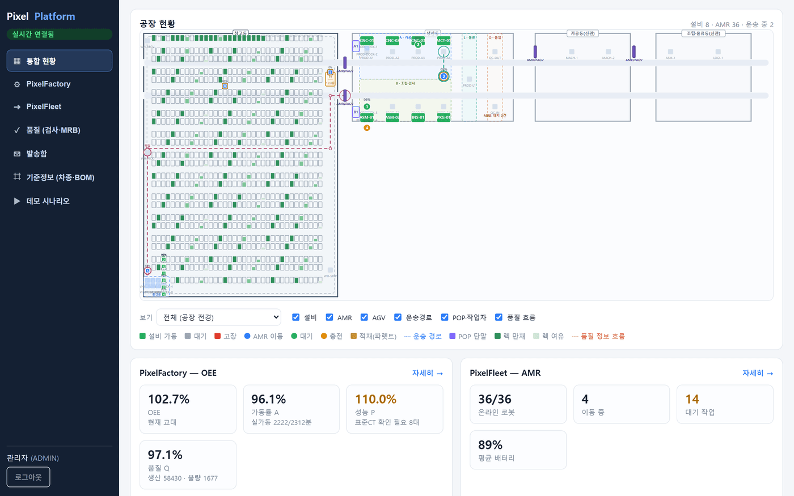
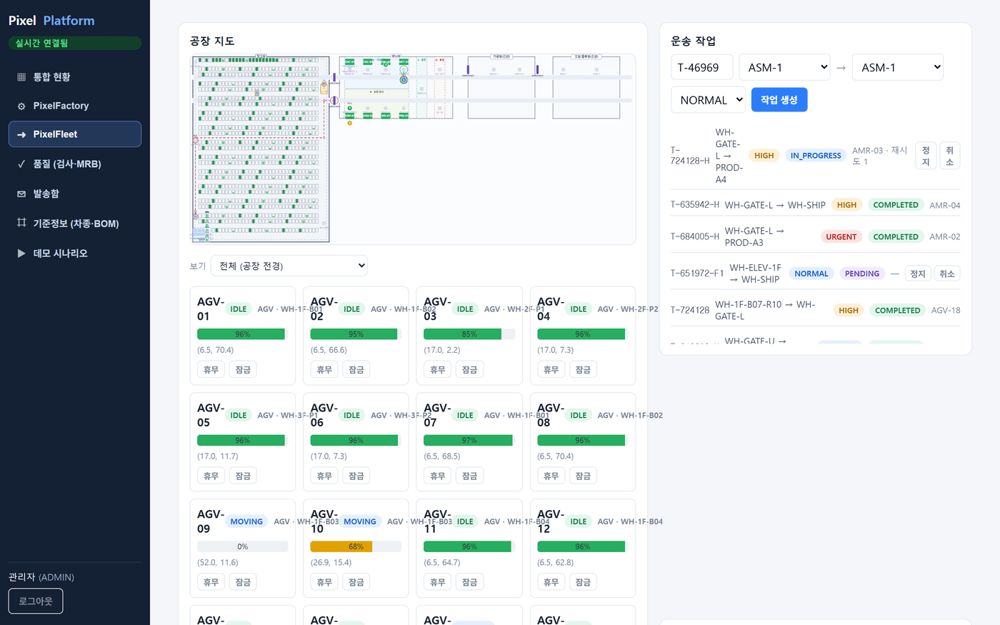
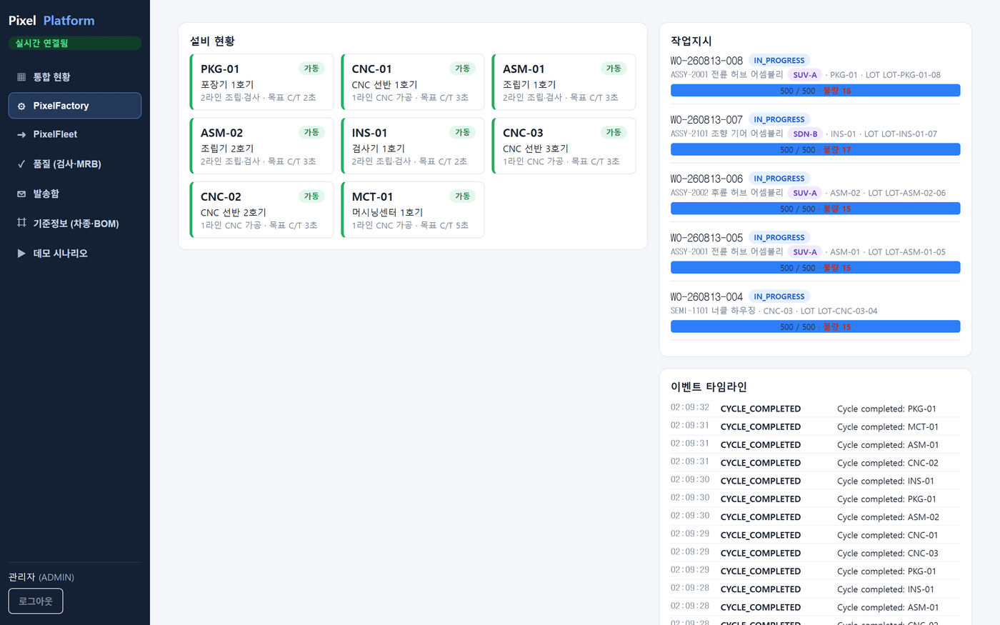

# 10분 투어 — 코드 없이 라이브 데모만으로

로컬에 아무것도 띄우지 않고 [라이브 데모](https://happyeon-pixel-platform.up.railway.app)만
클릭하면서 이 프로젝트가 뭘 하는지 10분 안에 파악하는 경로입니다. `admin` / `password`로
로그인하세요(화면에 미리 채워져 있습니다).

## 0~1분 — 랜딩

첫 화면 카드 4장이 이 프로젝트의 전부입니다: **PixelFactory**(OEE·설비), **PixelFleet**(AMR
군집 관제), **PixelWMS**(창고·재고), **PixelQMS**(품질·MRB). 4개가 각자 별개 서비스·별개 DB로
떠 있고, 게이트웨이 하나가 앞에 서 있습니다.

## 1~4분 — 통합 현황

로그인 후 첫 화면입니다.

- 왼쪽 지도는 실제 공장 레이아웃 좌표 위에 설비·AMR·운송경로를 실시간으로 그립니다. 초록 =
  가동, 빨강 = 고장, 파란 원 = 이동 중인 AMR — 범례가 화면 하단에 있습니다.
- 아래 타일의 `OEE 102.7%`, `성능 P 110.0%`처럼 **100%를 넘는 숫자를 그대로 보여주는 게 의도한
  동작**입니다. 표준 C/T가 실제보다 느슨하게 잡혀 있다는 신호를 죽이지 않고 남겨서, 값을 자르는
  대신 "몇 대가 표준CT 재확인이 필요한지"를 같이 보여줍니다. 근거: [`docs/pixel-platform-roadmap.md`](pixel-platform-roadmap.md) 0-A절.
- 몇 초 기다리면 숫자와 지도 위 위치가 바뀝니다 — MQTT로 들어온 텔레메트리가 실제로 흐르고
  있다는 뜻입니다.

## 4~7분 — PixelFleet: AMR 군집 관제

왼쪽 메뉴에서 **PixelFleet**로 이동합니다.

- AGV 카드마다 배터리 %, 좌표, 상태(IDLE/MOVING)가 실시간으로 바뀝니다. 오른쪽 "운송 작업"
  큐에는 우선순위(NORMAL/HIGH/URGENT)와 상태(PENDING → IN_PROGRESS → COMPLETED)가 흐릅니다.
- 이 큐의 배차 로직이 이 프로젝트에서 기술적으로 가장 깊은 부분입니다 — 노드-엣지 그래프
  위에서 A*/Dijkstra로 경로를 잡고, 구간(segment) 단위로 점유를 예약해 로봇끼리 충돌하지
  않게 합니다. 왼쪽 메뉴 아래 **데모 시나리오 → 설비 이상 주입**에서 "고장 주입"을 눌러보면,
  그 설비를 지나던 경로가 실시간으로 우회하는 걸 지도에서 볼 수 있습니다.
- 이 로직이 실제로 겪은 두 사고 위에 서 있습니다: 로봇 4대가 서로의 구간을 기다리며 멈춘
  hold-and-wait 교착, 배터리 20~24% 사각지대로 함대 전체가 선 사고. 둘 다
  [`docs/BACKLOG.md`](BACKLOG.md)에 기록돼 있고, 회귀 테스트로
  [`OrderServiceRegressionTest.java`](../modules/pixel-fleet/services/control-service/src/test/java/com/pixelfleet/order/service/OrderServiceRegressionTest.java)에 남아 있습니다.

## 7~9분 — PixelFactory: OEE·작업지시

**PixelFactory**로 이동합니다.

- 왼쪽은 설비별 가동 상태, 가운데는 작업지시 진행률(`500/500`)과 실시간 불량 수, 오른쪽은
  이벤트 타임라인(`CYCLE_COMPLETED` 등)입니다. 이 이벤트 스트림이 그대로 OEE 계산의 입력값이자
  MES 실적 데이터입니다(Event Sourcing) — 화면에 보이는 숫자는 별도 배치 집계가 아니라 이
  이벤트를 그대로 계산한 값입니다.

## 9~10분 — PixelQMS: 품질 홀드·MRB

왼쪽 메뉴 **데모 시나리오 → 설비 이상 주입**에서 "불량 폭주 주입"을 눌러본 뒤 **품질
(검사·MRB)** 메뉴로 이동해 보세요. 정상 경로는: 누적 불량이 임계(기본 3)를 넘으면
`oee-service`가 MQTT로 신호를 던지고, QMS가 구독해 검사를 만든 뒤 MRB가 열리면 **별개
서비스·별개 DB인 PixelFactory의 설비를 `QUALITY_HOLD`로 전환**합니다 — REST 계약만으로 두
도메인이 왕복하는, 이 프로젝트에서 "컴포저블 = 모놀리스 아님"을 가장 직접적으로 보여주는
지점입니다.

> **라이브 데모에서는 안 뜰 수도 있습니다.** 이 신호는 작업지시가 아직 계획 수량을 채우기
> 전 "진행 중"일 때만 나갑니다(`EquipmentTelemetryService.recordCycle`). 데모 인스턴스가
> 오래 켜져 있어 작업지시가 이미 목표 수량(예: 500/500)을 채운 채로 IN_PROGRESS로 남아있는
> 타이밍이면 버튼을 눌러도 실적이 더 안 잡혀 검사가 안 생깁니다 — 버그가 아니라 "실적 다
> 채운 작업지시엔 불량을 더 못 붙인다"는 규칙이 그대로 적용된 겁니다. 이 경우
> [`EquipmentTelemetryService.java`](../modules/pixel-factory/services/oee-service/src/main/java/com/pixelfactory/telemetry/service/EquipmentTelemetryService.java)의
> `requestInspectionIfDefectThresholdExceeded`를 코드로 읽는 게 가장 정확합니다.

## 더 보고 싶다면

- **설계 근거를 코드보다 먼저**: [`docs/pixel-platform-roadmap.md`](pixel-platform-roadmap.md) —
  단계별로 원안이 실제로 갈라진 지점과 그 이유
- **터진 장애 기록**: [`docs/BACKLOG.md`](BACKLOG.md)
- **인증 경계와 알려진 구멍**: [`docs/auth-boundaries.md`](auth-boundaries.md)
- **로컬에서 직접 띄우기**: 메인 [`README.md`](../README.md)의 Quick Start
